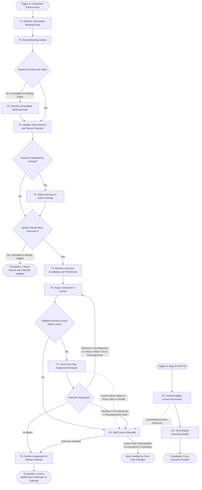

# Workflow of Tasks

## 1. Workflow Goal

This workflow supports the goal in our completed [team charter](https://github.com/IronNemesis/Team-Build-Repo/blob/main/README.md).

## 2. Workflow Trigger

The workflow has two triggers:

- **Booking run:** A FareHarbor notification email (new booking, cancellation, or reschedule) arrives in the surf school's booking inbox. Each email starts one run.
- **Nightly summary run:** The clock reaches 8:00 PM local time each day.

## 3. Completion Condition at Runtime

- **Booking run:** The lesson's row in the Lesson Log and its event on the Shared Lesson Calendar match the FareHarbor email, and either every required instructor slot has an instructor who accepted (or was staffed by the Front Desk Manager), or the lesson was cancelled and every released instructor has been notified.
- **Nightly summary run:** Every instructor on the roster has been sent exactly one summary email for the next day (listing their confirmed lessons, or stating "no lessons"), and every lesson for the next day that is not fully confirmed has been flagged to the Front Desk Manager.

## 4. General Workflow

All records live in one Lesson Scheduling Google Sheets workbook (Lesson Log, Assignment Requests, and Run Log tabs) plus the Instructor Availability Sheet, where instructors maintain their available start and end times and preferences (skill level, age range, time of day). Lessons appear on a Shared Lesson Calendar in Google Calendar, and all messages are sent through Gmail.

For a booking run, **T1: Retrieve FareHarbor Booking Email** retrieves the new notification and **T2: Extract Booking Details** reads its fixed template: notification type (new, cancelled, or rescheduled), booking number, lesson type, date and time, headcount, each student's experience level and age, the customer's FareHarbor contact ID, and the number of instructors required (one per five students, rounded up). Private lessons are always their own session; open group bookings at the same lesson type, date, and time are combined into one session, and the ratio applies to the session's total headcount. **T3: Update Lesson Record and Shared Calendar** adds, moves, or removes the session in the Lesson Log and on the calendar. If the change releases an instructor (a cancellation, a reschedule, or a group session that now needs fewer instructors), **T4: Notify Instructor of Lesson Change** emails each released instructor. If the session needs more instructors, **T5: Retrieve Instructor Availability and Preferences** reads the Instructor Availability Sheet and **T6: Assign Instructors to Lesson** chooses an instructor for each open slot, respecting availability, calendar conflicts, and a maximum of two lessons per instructor per day, while keeping repeat customers with their previous instructor, matching instructor preferences, and spreading lessons evenly. **T7: Send One-Click Assignment Request** emails each chosen instructor with Accept and Decline buttons, and **T8: Confirm Assignment on Shared Calendar** adds the instructor to the calendar event when they accept.

If T2 cannot read the email or a required field is missing, the Front Desk Manager performs **H1: Resolve Unreadable Booking Email**, enters the booking details from FareHarbor, and the run resumes at T3. If T6 cannot find an eligible instructor within its limits, the Front Desk Manager performs **H2: Staff Lesson Manually**. If an instructor declines or does not respond within 4 hours, the run returns to T6 with that instructor excluded; after two reassignments, the slot goes to H2. If the lesson starts within 12 hours, T7 also alerts the Front Desk Manager through H2 at the same time it sends the request. In H2, the Front Desk Manager either arranges an instructor (the run resumes at T8) or reschedules or cancels the booking in FareHarbor, which stops this run and starts a new one from the resulting email. If any other automated task fails, times out, or has an uncertain outcome, the run stops at that task, records the status, and escalates to the Front Desk Manager.

For the nightly summary run, **T9: Compile Nightly Lesson Summaries** builds one summary per instructor for the next day's confirmed lessons, including a "no lessons" summary for instructors with none, and flags any next-day lesson without full confirmation to the Front Desk Manager through H2. **T10: Send Nightly Summary Emails** sends each instructor their summary.

## 5. Workflow Diagram

